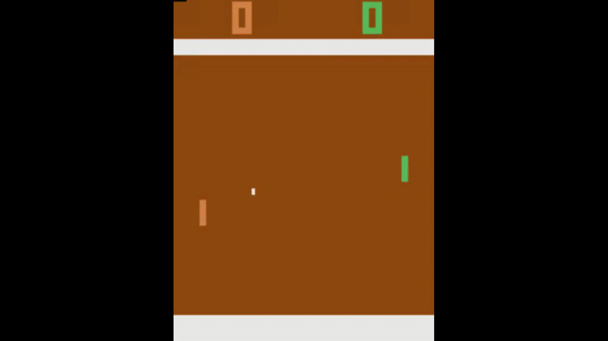
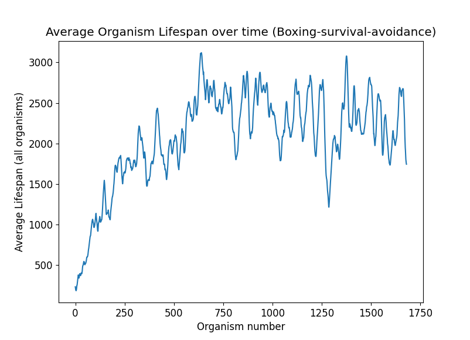

## Evolutionary Self-Replication as a Mechanism for Producing Artificial Intelligence


 


#### A simple evolutionary self-replicator

To better understand the way in which intelligent self-replicators emerge from a computational perspective, presented below is a minimalistic implementation of the code used to develop evolutionary self-replicators.


### The Replicator
```
class Replicator:
    """ Individual self-replication structure """
    def __init__(self):
        """ Initialize replicator """
        self.lifespan = 0
        self.network = RecurrentNeuralNetwork(
            output_dim=self.env.action_space.n,
            input_dim=self.env.observation_space.shape[0],)
        self.env = evo_gym.make("CartPole-survival-v0")
        self.env_state = self.env.reset()
```
> Each replicator contains a behavior generator, here, a recurrent neural network, and information about the environment with which it is surviving in.

```
    def reset(self):
        """
        Reset internal parameters and environment
        :return: None
        """
        self.lifespan = 0
        self.network.reset()
        self.env_state = self.env.reset()
```
> The reset function resets the environment, network, and lifepsan counter, used to reset the information in replicated copies of the parent replicator.

```
    def replicate(self):
        """
        Replicate mutated copy of self
        :return: (Replicator) mutated copy
        """
        variant = deepcopy(self)
        variant.reset()
        variant.network = variant.network.mutate()
        return variant
```
> The replicate function provides the ability for replication by producing an identical copy of the original replicator (the variant) and mutating it's structure (behavioral structure through neural network weights, in this case). The network and environment parameters are reset accordingly.
```
    def step(self):
        """
        Replicator's interaction with environment
        :return: (bool) whether or not replicator died
        """
        self.lifespan += 1
        action = self.network.forward(self.env_state)
        action = np.argmax(action)
        self.env_state, death, _info = self.env.step(action)
        return death
```
> The step function is the mechanism from which the organism interacts with the environment, and partakes in survival. Quite simply, an action is taken given an environment state, and that action is applied to the organism's embodied self. The new state, and whether or not the organism died is returned. If the organism dies (as will be seen below) it is simply removed from the grid to make room for other organisms to replicate into that position.


### The Neural Network
```
class RecurrentNeuralNetwork:
    """
     Simple one-hidden-layer neural network
     structure with recurrent connections on the hidden layer
    """
    def __init__(self, input_dim, output_dim, mutation_scale=0.01, hidden=32):
        """
        Neural network initialization
        :param input_dim: (int) sensory input dimensionality
        :param output_dim: (int) action output dimensionality
        :param mutation_scale: (float) weight-mutation scale
        :param hidden: (int) hidden layer dimensionality
        """
        self.hidden = hidden
        self.input_dim = input_dim
        self.output_dim = output_dim
        self.mutation_scale = mutation_scale
        self.rw1_trace  = np.zeros((1, self.hidden))
        self.w1 = np.zeros((self.input_dim, self.hidden))  # parameter
        self.rw1  = np.zeros((self.hidden, self.hidden))   # parameter
        self.w2 = np.zeros((self.hidden, self.output_dim)) # parameter
```
> Here, w1, rw1, and w2 represent the parameters of the network, which are mutated during organism replications. While nearly any aspect of the organism can be mutated, the network weights were chosen to relate this with other AI applications. Future work could include mutating network structure, the robotic morphology, or even the code itself; there are no limitations, and hence plenty of room for creativity.
```
    def reset(self):
        """ Reset recurrent trace """
        self.rw1_trace  = np.zeros((1, self.hidden))
```
> Resets internal parameters, in this case, the recurrent trace.
```
    def forward(self, x):
        """
        Forward propagate sensory information (x)
        :param x: (np.ndarray(np.float64))
            environmental sensory information
        :return: (np.ndarray(np.float64))
            propagated action information
        """
        x = x.reshape((1, x.size))
        x = np.tanh(np.matmul(x, self.w1) +
            np.matmul(self.rw1_trace, self.rw1))
        self.rw1_trace = x
        return np.matmul(x, self.w2)
```
> Take environmental sensory input (x) and output a behavior produced by the network.
```
    def mutate(self):
        """
        Mutate neural network and return modified copy
        :return: (NeuralNetwork) modified/mutated copy of self
        """
        variant = deepcopy(self)
        variant.w1 += np.random.normal(
            loc=0.0, scale=variant.mutation_scale, size=variant.w1.shape)
        variant.rw1 += np.random.normal(
            loc=0.0, scale=variant.mutation_scale, size=variant.rw1.shape)
        variant.w2 += np.random.normal(
            loc=0.0, scale=variant.mutation_scale, size=variant.w2.shape)
        return variant
```
> Mutate the network weights with gaussian noise.

### The Replication Grid

```
class ReplicationGrid:
    """
    1-Dimensional grid containing replicators
    -- the medium with which replication occurs
    """
    def __init__(self):
        """ Initialize grid parameters """
        self.organisms = 0
        self.grid_dim = 32
        self.mutation_prob = 1.0
        self.replication_prob = 0.1
        self.grid_range = list(range(self.grid_dim))
        self.grid = [None for _ in range(self.grid_dim)]
```
> Initialize grid and organism mutation parameters. The replication probability determines the likelihood of organism replication at any given timestep. The mutation probability determines the likelihood of a mutation occuring during replication. The rest determine the 1-dimensional grid structure.
```
    def step(self):
        """
        Replicator's interaction with environment
        including replication, creation, and death
        :return: (list(Replicator)) list of (recently) dead replicators
        """
        if self.organisms == 0:
            self.organisms += 1
            self.grid[np.random.choice(self.grid_range)] = Replicator().replicate()
        death_indices = list()
        replication_indices = list()
        for _org in self.grid_range:
            if self.grid[_org] is None:
                continue
            death = self.grid[_org].step()
            if death: death_indices.append(_org)
            elif np.random.uniform(low=0.0, high=1.0) < self.replication_prob:
                replication_indices.append(_org)
        self.replicate(replication_indices)
        return self.death(death_indices)
```
> This function begins by checking if there are any organisms in the grid, if not, then create an initial organism. Then, iterate through every organism in the grid (None means there is nothing there) and have that organism interact with the environment and return whether or not it died. This is followed by a random determining of whether the organism undergoes self-replication. Finally, the the self-replication and death functions are called to process organism replications and deaths.
```
    def death(self, death_indices):
        """
        Remove dead replicators from grid
        :param death_indices: (list(int)) list of dead replicator indices
        :return: (list(Replicator)) list of (recently) dead replicators
        """
        dead_orgs = list()
        for _org in death_indices:
            dead_orgs.append(self.grid[_org])
            self.organisms -= 1
            self.grid[_org] = None
        return dead_orgs
```
> This function just iterates through each organism that died and removes it from the grid.
```
    def replicate(self, replication_indices):
        """
        Replicate organism indices
        :param replication_indices: (list(int))
         list of replications that are to occur
        """
        np.random.shuffle(replication_indices)
        for _org in replication_indices:
            free_neighbors = list()
            if self.grid[(_org + 1) % self.grid_dim] is None:
                free_neighbors.append((_org + 1) % self.grid_dim)
            if self.grid[(_org - 1) % self.grid_dim] is None:
                free_neighbors.append((_org - 1) % self.grid_dim)
            if len(free_neighbors) == 0:
                break
            self.organisms += 1
            np.random.shuffle(free_neighbors)
            if np.random.uniform(low=0.0, high=1.0) < self.mutation_prob:
                self.grid[free_neighbors.pop(0)] = self.grid[_org].replicate()
            else:
                free_neighbor = free_neighbors.pop(0)
                self.grid[free_neighbor] = deepcopy(self.grid[_org])
                self.grid[free_neighbor].reset()
```
> Perfom the replication procedure. It is necessary to shuffle the replication indices to make sure that there is no preference for lower-numbered organism grid indices (since they execute first on the step cycle). Check the neighboring grid cells, and replicate into them if they are free (mutating if that is sampled for, otherwise a pure replication). 


#### Environments

##### Environment usage
```
import evo_gym

env = evo_gym.make(env_id)
state = env.reset()

# notice there is no reward being returned...
state, death, _info = env.step(action)
```
##### Implemented Environments (described in paper)
```
CartPole-survival-v0
ReacherForager-v0
HalfCheetahForager-v0
WalkerForager-v0
Boxing-survival-avoidance-v0
Boxing-survival-fight-v0
Pong-survival-v0
Pong-survival-forager-v0
SpaceInvaders-survival-v0
BattleZone-survival-forager-v0
```

##### Training with these environments
> The evolutionary_replicator.py file has all of the necessary capabilities and functionality to reproduce the behaviors presented in the paper. Additional environments can be easily added to the evo_gym repository for custom trainings. This algorithm is not limited to the usage of a small recurrent neural network; it can realistically be changed to any sort of behavior producing algorithm as long as there is a mechanism for mutation. To change this, just replace the RecurrentNeuralNetwork class with some alternative model with a mutate() and reset() function, plug it in, and it should run! 
> I tried to keep everything as simple as possible for ease of understanding as well as ease of use and replicability. I hope you enjoy the interesting phenomenon of evolutionary self-replication, and it inspires some novel and interesting future work.


#### An example of lifespan growth

##### Boxing Survial Avoidance



#### Some ideas for Future Research

##### Mutational structure
The behavior of each organism need not be generated by fixed-structure neural networks.
The mutational structure by which evolution acts on is perhaps one of the most interesting avenues of future research, because, within this framework, really anything can be optimized, such as: code, neural topology, robot morphology, and even novel algorithms themselves.


##### Replication structures
Replication need not be limited to a 1-dimensional grid, let alone a discrete structure at all. Replication could occur in a more physically-realistic environment, where life, death, and replication are all intertwined physically, rather than being separated into grid-like elements. 
Replication could also occur in a more natural computational structure, such as a file system, or in computer memory (like Core Wars).
A long proposed idea floating around within NASA is the concept of self-replicating space probes, which have the capability of evolution under the condition that replication causes mutational changes.

##### Foragers
The introduction of metabolism and survival into the environment opens the possibility of determining the effect of adding energy constraints to (neural or morphological) design and determining optimal structures in a natural selection context. Perhaps massive brains like humans emerge in complex environments, or perhaps miniscule, hyper-tuned brains emerge like small bugs and such.

##### Creativity
One of the appealing aspects of evolutionary self-replication, is that the evolutionary design is unlimited in potential, and is open to a significant degree of creativity in design.
I would love to see some creative and unique approaches emerge; creativity is essential.
